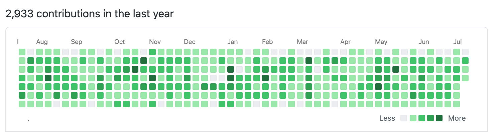

# react-github-graph



## Purpose

React Github Graph is a lightweight React component that displays Github contributions for a given user. 

## Installation
```
npm install react-github-graph --save
```

or

```
yarn add react-github-graph
```

## Usage

```jsx
import React from "react";
import { Github } from "react-github-graph"

class Page extends React.Component {

	//...
	render() {
		return (
			<Github username="{your username here}"></Github>
		)
	}

}

```

## Notes
Currently depends on the following resources:
- https://cors-anywhere.herokuapp.com
- https://github.com

If one of these resources is down, the component will not be able to load and will hide itself